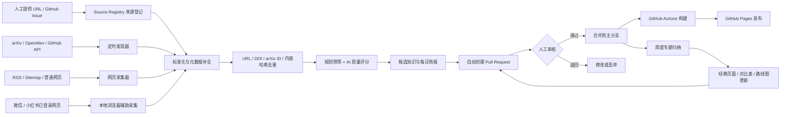

# RoboOpus：具身智能 / 机器人自生长知识库架构方案

> 版本：v0.2  
> 日期：2026-09-08  
> 目标：先用一个轻量、可审阅、可追溯的 GitHub 知识站跑通闭环，再逐步升级为具备检索、归纳、关联、纠错和知识演化能力的研究基础设施。

## 1. 先给结论

这个系统可以做到，但“自生长”和“自进化”应拆成两个不同问题：

- **自生长**：自动发现、抓取、解析、去重、评分并生成新知识条目。
- **自进化**：定期把零散条目合并进专题综述，更新算法对比、知识关系、术语和过时结论，并保留修改历史。

推荐的第一版是：

> **RoboOpus GitHub 组织 + 普通项目仓库及其 GitHub Pages 项目站 + 静态知识站 + Markdown/JSON 数据 + Python 采集流水线 + GitHub Actions + Codex 定时任务/技能 + PR 人工审核。**

当前 `wam` MVP 已选用 Vinext/React 静态导出，以便做定制化研究索引；当内容规模扩大、侧栏与全文搜索成为主要需求时，再评估 Astro Starlight。

硬约束：`RoboOpus/RoboOpus.github.io` 是唯一的组织站仓库，本项目不创建、不修改、不部署到该仓库。所有知识站均使用 `https://roboopus.github.io/<repository>/` 形式的项目站。

第一版不需要向量数据库、复杂后端或多智能体平台。先把“来源登记 → 采集 → 标准化 → 生成候选知识 → 人工审核 → 发布网站”闭环跑稳。内容达到几千篇、需要跨文档问答后，再加入向量检索和知识图谱。

## 2. 核心原则

1. **Git 是知识的事实账本**：每次新增、修改、纠错都有 diff、作者和时间，任何错误都能回退。
2. **AI 只生成候选，不直接改写事实**：自动流程创建 PR，不自动合并到主分支。
3. **原始来源、机器摘要、人工结论分层存放**：绝不能让 AI 摘要伪装成原文或你的观点。
4. **每条知识必须可追溯**：保留 URL、作者、发布时间、抓取时间、版本、许可、内容哈希和引用。
5. **公开层与私有层分开**：个人 idea、未公开项目、登录 Cookie、论文全文缓存不进入公开仓库。
6. **优先 API / RSS / Sitemap，其次普通网页解析，最后才是浏览器自动化**。
7. **不绕过验证码、登录限制或反爬机制**；尊重 robots.txt、平台条款、版权和访问频率。
8. **“copy 优秀网站”应理解为借鉴信息架构、交互和视觉语言**；未经许可不复制对方文字、图片、品牌资产或专有代码。

## 3. 整体架构



这里的关键不是“抓得多”，而是让新增知识最终进入一个可维护的专题结构，而不是堆成无人阅读的收藏夹。

## 4. 网站信息架构

### 4.1 首页与全局入口

- 今日新增、近 7 天精选、最近更新的经典页面
- 全站搜索
- 主题地图：VLA、WAM、世界模型、操作、导航、感知、规划、控制、硬件
- “提交一个来源”入口
- 更新日志、数据统计、知识库方法说明

### 4.2 关于我 / RoboOpus

- 个人简介与公开简历
- 研究兴趣、能力地图、公开 idea
- 个人项目与 Demo
- 个人网站
- 优秀网站案例库：截图、可借鉴点、信息架构分析、原站链接和许可说明

个人 idea 建议使用 `visibility: private | public-candidate | public` 三态；默认 `private`。

### 4.3 前沿雷达

- arXiv 每日雷达
- 每周精选与趋势总结
- 顶会 / 顶刊追踪
- 研究者访谈
- 微信公众号文章索引与点评
- 小红书公开讨论索引与点评
- GitHub 新项目、版本发布、Star 增长和活跃度观察
- “热点”和“长期价值”分开评分，避免知识库被短期流量主导

### 4.4 VLA / WAM 经典知识

- 发展时间线与术语表
- 经典论文卡片
- 算法族谱、输入输出、训练目标、数据、推理方式
- 模型对比矩阵
- 复现教程、开源代码、模型权重、数据集和许可证
- 失败案例、适用边界、常见误解
- 从经典页面反向链接到最新工作

### 4.5 Model-based 机器人基础

- 感知：检测、分割、位姿、深度、触觉、多模态融合、状态估计
- 定位与建图：VO / VIO / SLAM / 语义地图
- 规划：搜索、采样、优化、任务与运动规划、轨迹优化
- 控制：PID、状态空间、MPC、阻抗 / 导纳、最优控制、鲁棒控制
- 动力学、系统辨识、接触建模
- 仿真与 sim-to-real
- 每个主题均提供“概念 → 数学 → 代码 → 实验 → 硬件”的学习路径

### 4.6 机器人硬件系统

- 机械臂、移动底盘、人形、四足、灵巧手、夹爪
- 相机、深度相机、激光雷达、IMU、力矩 / 触觉传感器
- 控制器、边缘计算、实时总线、电机与驱动
- 关键字段：厂商、型号、自由度、负载、臂展、重复定位精度、接口、ROS 支持、开源状态、价格、价格地区、价格日期、数据来源
- 价格必须带 `price_checked_at` 和币种；过期后自动标红，而不是静默保留旧价格
- 开源硬件项目、BOM、装配教程和许可证

### 4.7 相邻领域灵感库

- 大模型：推理、Agent、长上下文、多模态、后训练
- CV：视频理解、3D / 4D、生成模型、视觉表征
- 自动驾驶：世界模型、闭环评测、仿真、数据引擎、端到端系统
- 只收录“对机器人有什么可迁移价值”的内容，并增加 `transfer_to_robotics` 字段

## 5. 内容与数据模型

每一条知识使用 Markdown + YAML Front Matter。建议最小模板如下：

```yaml
---
id: paper-arxiv-2609.01234
title: Example Paper
title_zh: 示例论文
kind: paper                 # paper / article / repo / hardware / idea / interview
section: frontier/vla
source_url: https://arxiv.org/abs/2609.01234
canonical_url: https://arxiv.org/abs/2609.01234
authors: [Author A, Author B]
published_at: 2026-09-03
fetched_at: 2026-09-07T07:17:00+08:00
updated_at: 2026-09-07
identifiers:
  arxiv: "2609.01234"
  doi: null
tags: [VLA, manipulation, world-model]
status: candidate             # inbox / candidate / reviewed / canonical / deprecated
visibility: public
language: en
license: unknown
content_hash: sha256:...
quality:
  relevance: 27
  technical_depth: 17
  evidence: 12
  reproducibility: 13
  novelty: 8
  total: 77
confidence: medium
generated_by: codex
reviewed_by: null
related: []
---
```

正文固定包含：

1. 一句话结论
2. 解决什么问题
3. 方法与关键假设
4. 实验与证据
5. 局限与潜在反例
6. 与已有工作的关系
7. 对 RoboOpus / 具身智能的启发
8. 代码、数据和复现状态
9. 来源与引用

必须区分：

- `source_excerpt`：少量、合规的原文摘录
- `machine_summary`：机器摘要
- `editor_notes`：你的观点
- `verified_facts`：核验过的事实

## 6. 来源接入策略

| 来源 | 第一版方式 | 后续方式 | 主要风险 |
|---|---|---|---|
| 个人网站 / 博客 / CSDN | 人工 URL、RSS、Sitemap；Trafilatura 抽正文 | 域名级增量抓取 | 页面变化、版权、重复内容 |
| 访谈 / 视频 | 页面、字幕或人工提供文本 | YouTube / Bilibili 字幕适配器 | 转写误差、缺少上下文 |
| arXiv | 官方 API / Atom Feed | OpenAlex 引用和主题补全 | 最新论文引用数失真 |
| 顶会 / 顶刊 | 官方 RSS、Crossref、OpenAlex | 会议日程和录用列表适配器 | 同名、版本合并 |
| GitHub | REST / GraphQL API、README、Release、论文链接 | 浅克隆后代码结构分析 | README 宣传偏差、许可证 |
| 微信公众号 | **优先人工粘贴文章链接**，普通解析失败时用已登录浏览器读取可见正文 | 自建 RSSHub 路由或维护中的 WeWe RSS 社区分支，仅作可替换适配器 | 原 WeWe RSS 已归档；登录失效、封控、版权 |
| 小红书网页版 | **优先人工粘贴笔记 URL + 本地已登录浏览器辅助提取** | Playwright 适配器；MediaCrawler 只用于符合其许可证的非商业学习 | 反爬、账号风险、平台条款、内容版权 |

### 微信与小红书的现实建议

不要把这两个平台当成第一版的稳定“全自动数据源”。最稳妥的 MVP 是：

1. 你把值得收录的链接丢进 `inbox/urls.yaml` 或带 `source-inbox` 标签的 GitHub Issue。
2. 本地浏览器使用你已有的登录会话打开页面。
3. 只提取你有权访问的可见文本、作者、时间和链接。
4. 公开站只发布你的摘要、少量必要摘录和原链接；原始快照放私有缓存且不提交 Git。

工具优先级：

- 普通文章：`Trafilatura`
- JavaScript 动态页面：`Playwright`
- 微信订阅：自建 `RSSHub` 路由；WeWe RSS 原仓库已于 2026-05-11 归档，因此只能把社区分支作为可替换插件，不能作为核心依赖
- 小红书研究性采集：`MediaCrawler` 支持 Playwright 和登录态，但其许可证限定非商业学习用途；先审查许可证和平台规则
- 单篇归档：可评估 `OmniSaver`，但不要把“绕过限制”的功能接入无人值守流水线

## 7. 论文发现与质量评分

### 7.1 每日发现范围

第一批 arXiv 类别：

- `cs.RO`
- `cs.CV`
- `cs.AI`
- `cs.LG`

核心关键词组：

- embodied intelligence / embodied AI
- vision-language-action / VLA
- world model / world action model / WAM
- robot manipulation / dexterous manipulation
- robot learning / imitation learning / reinforcement learning
- diffusion policy / flow matching policy
- navigation / locomotion / humanoid
- tactile / force sensing / multimodal robot
- motion planning / MPC / model-based control

### 7.2 评分建议（总分 100）

- 与 RoboOpus 主题相关性：30
- 技术深度与问题重要性：20
- 实验证据与评测完整性：15
- 代码 / 数据 / 权重与可复现性：15
- 方法新颖性：10
- 可迁移到真实机器人或其他主题的价值：10

阈值：

- `>= 75`：进入每日精选候选
- `60–74`：进入观察池
- `< 60`：只保留元数据或忽略

不要直接用引用数给新论文判死刑。引用、Star 和讨论热度需要按论文年龄归一化，并作为辅助信号，而不是事实质量本身。

### 7.3 去重与版本合并

依次使用：DOI → arXiv ID → 规范化标题 + 作者 → canonical URL → 正文哈希。arXiv、会议版和期刊版应合并到一个知识实体中，版本分别保留。

## 8. “自进化”机制

知识条目状态：

```text
inbox → candidate → reviewed → canonical → deprecated
                     ↘ rejected
```

- **每日**：发现新论文和项目，生成候选卡片与日报 PR。
- **每周**：把高质量候选并入专题，更新对比表、时间线和“本周发生了什么变化”。
- **每月**：检查失效链接、硬件价格日期、仓库活跃度、论文版本和相互矛盾的结论。
- **每季度**：重构分类体系，合并重复页面，建立经典路线图；需要人工批准。

自进化不是让模型随意重写旧内容，而是：

1. 找到新增证据对旧结论的影响。
2. 生成带引用的修改 diff。
3. 在 PR 中解释“为什么改、依据是什么、置信度多高”。
4. 通过测试和人工审核后合并。
5. 使用 Git 历史保留旧版本。

## 9. 推荐软件栈

### 第一阶段（推荐）

| 层 | 选择 | 原因 |
|---|---|---|
| 托管 | GitHub Organization + GitHub Pages | 免费起步、版本可追溯、PR 审核、可绑定域名 |
| 知识站 | 当前 WAM：Vinext/React 静态导出；规模化候选：Astro Starlight | 前者便于定制研究首页，后者适合大量 Markdown、侧栏与 Pagefind 搜索 |
| 内容 | Markdown + YAML + JSON | 人和 AI 都容易读写，Git diff 清楚 |
| 本地索引 | SQLite 或 DuckDB | 去重、查询和流水线状态管理足够，部署简单 |
| 采集 | Python 3.11+、`uv`、`httpx`、`feedparser`、`trafilatura`、`playwright`、`pypdf` / `PyMuPDF` | 覆盖 RSS、网页、动态页面和 PDF |
| 论文元数据 | arXiv API + OpenAlex；需要时增加 Crossref | 发现、标识符、作者、引用和开放获取信息互补 |
| 代码来源 | GitHub API + `git clone --depth 1` | 先看元数据和 README，需要深入分析时再浅克隆 |
| Agent | Codex + 项目 `AGENTS.md` + `$roboopus-curator` 自定义 Skill | 固化收录、核验、摘要、评分和 PR 流程 |
| 自动化 | GitHub Actions + Codex Scheduled Tasks | 前者稳定远程执行，后者适合研究判断和持续上下文 |

### 第二阶段（内容达到约 2,000–10,000 条后再考虑）

- 向量检索：Qdrant 或 LanceDB
- 嵌入：OpenAI Embeddings 或本地 `bge-m3`
- 混合检索：BM25 / Pagefind + 向量 + 元数据过滤
- API：FastAPI
- 结构化数据库：PostgreSQL
- 原始对象存储：MinIO / S3 / R2，仅存有权保存的材料
- 关系层：先用 `related`、`cites`、`implements`、`uses_hardware` 等边；确有复杂查询后再上 Neo4j

第一版不要先上 LangChain、复杂多 Agent 编排或独立知识图谱数据库。它们会增加调试成本，但不会自动提高知识质量。

## 10. RoboOpus GitHub 组织和仓库规划

`RoboOpus` 组织已经建立。本项目采用普通仓库的 GitHub Pages **项目站**：

- 保留且不触碰：`RoboOpus/RoboOpus.github.io`
- 未来总知识库：`RoboOpus/knowledge` → `https://roboopus.github.io/knowledge/`
- 当前 WAM 子站：`RoboOpus/wam` → `https://roboopus.github.io/wam/`
- 后续板块可继续拆为 `hardware-knowledge`、`robotics-foundations` 等普通仓库
- 站点的 base path 必须与仓库名一致，即 `/wam/`

### 当前 MVP：一个 WAM 普通项目仓库

```text
RoboOpus/wam
├─ AGENTS.md
├─ README.md
├─ package.json
├─ next.config.ts          # output: export；静态资源前缀: /wam
├─ app/                    # 首页与论文详情页
├─ components/
├─ lib/                    # 结构化页面数据
├─ content/                # Markdown 研究资料
├─ public/
├─ sources/
│  ├─ registry.yaml
│  ├─ arxiv_queries.yaml
│  └─ allowlist.yaml
├─ inbox/
│  └─ urls.yaml
├─ data/
│  ├─ papers.jsonl
│  └─ repos.jsonl
├─ scripts/
│  ├─ discover_arxiv.py
│  ├─ ingest_url.py
│  ├─ enrich_openalex.py
│  ├─ deduplicate.py
│  ├─ build_digest.py
│  └─ validate_content.py
├─ prompts/
│  ├─ paper_card.md
│  ├─ weekly_synthesis.md
│  └─ evolution_audit.md
├─ private-cache/          # 必须在 .gitignore 中
├─ .github/workflows/
│  ├─ deploy.yml
│  ├─ daily-arxiv.yml
│  └─ link-check.yml
└─ tests/
```

### 稳定后扩展为多个项目站

- `knowledge`：跨板块总导航与精选内容；项目站为 `/knowledge/`
- `wam`：WAM 专题、论文卡、阅读路线与日报；项目站为 `/wam/`
- `roboopus-pipeline`：采集、解析、评分和发布工具；可不启用 Pages
- `roboopus-private`：私有 idea、未发布简历、原始缓存；必须私有且不启用 Pages
- `awesome-embodied-ai`：适合社区协作的精选索引；项目站为 `/awesome-embodied-ai/`
- `.github`：仅用于组织 Profile、贡献规范和 Issue 模板，不等于组织 Pages 站

## 11. 自动化设计

### 11.1 每天早晨 arXiv 自生长

建议时间：每天北京时间 07:17，避开整点高负载。

```yaml
on:
  workflow_dispatch:
  schedule:
    - cron: "17 7 * * *"
      timezone: "Asia/Shanghai"
```

工作流只做以下事情：

1. 读取 `sources/arxiv_queries.yaml`。
2. 从 arXiv 获取最近 24–48 小时条目。
3. 用 DOI / arXiv ID / 标题去重。
4. 规则预筛，再对少量候选做 AI 评分与摘要。
5. 生成 `frontier/daily/YYYY-MM-DD.md` 和候选论文卡。
6. 运行元数据、链接、Front Matter 和站点构建测试。
7. 创建 `daily-arxiv/YYYY-MM-DD` 分支和 PR。
8. 由你合并，合并后自动发布。

GitHub 定时任务可能延迟，且公共仓库连续 60 天没有活动时可能被自动停用；因此日报不是严格实时系统，仍应提供 `workflow_dispatch` 手动触发入口。

### 11.2 Codex 与 GitHub Actions 的分工

**无需 OpenAI API Key 的轻量模式：**

- GitHub Actions 只负责 arXiv 元数据发现、去重、建站和发布。
- Codex 桌面端定时任务在本地项目 / worktree 中阅读候选、生成摘要和 PR。
- 本机需要保持开机，Codex 桌面应用需要运行。

**完全云端模式：**

- 在 GitHub Actions 使用 `openai/codex-action@v1`。
- 将 API Key 放在 GitHub Secret，绝不提交到仓库。
- 为 Action 设置最小权限，只允许写候选分支或 PR。
- 严格限制外部网页内容进入 prompt，防止 prompt injection。

推荐先用轻量模式观察 2–4 周的误报、成本和摘要质量，再决定是否完全云端化。

### 11.3 自定义 Codex Skill

后续创建 `$roboopus-curator`，统一以下指令：

- 收录一个 URL / DOI / arXiv ID / GitHub 仓库
- 搜索指定主题和时间范围
- 生成论文卡、项目卡、硬件卡
- 检查重复与版本关系
- 生成每日 / 每周简报
- 对比新证据与 canonical 页面
- 创建带说明的 PR，不直接合并

项目根目录 `AGENTS.md` 则负责不可违反的规则，例如引用要求、目录规范、验证命令、隐私边界和“禁止自动合并”。Codex 官方文档说明它会在工作前读取项目中的 `AGENTS.md`，适合承载这些持久约束。

## 12. 你可以直接对 Codex 下的指令

```text
收录这个 URL。只保存元数据、我的中文摘要和原链接，不公开复制全文。
```

```text
搜索最近 7 天 arXiv 中与 VLA、world action model、灵巧操作相关的工作；去重后给出 Top 10，并为总分超过 75 的条目创建候选卡片和一个 PR。
```

```text
比较 π0、OpenVLA、RDT、Octo 的观测、动作空间、训练数据、模型结构、部署条件、开源程度和真实机器人结果；每个关键结论都要给出处。
```

```text
检查 hardware/ 下超过 90 天没有核验的价格，把页面标为 stale，并生成待复核清单；不要猜测新价格。
```

```text
审计本周新增论文是否改变 vla-wam/world-models.md 的已有结论。只提交有明确证据支持的 diff。
```

## 13. 分阶段实施路线

### Phase 0：规则与边界（半天）

- 明确站点公开还是私有；默认公开站 + 私有 idea/cache
- 确定中英文策略：推荐中文讲解、保留英文标题和术语
- 建立许可、引用、隐私和自动化边界
- 固化“不触碰 `RoboOpus/RoboOpus.github.io`”规则和项目站命名约定

### Phase 1：静态站 MVP（1–2 天）

- 创建普通项目仓库 `RoboOpus/wam`
- 先整理 WAM 定义、两套分类、经典论文路线和近期 arXiv 论文
- 再搭知识站前端、搜索和 `/wam/` 项目站部署
- 添加 15–30 条人工精选种子内容
- 添加 Front Matter 校验和链接检查

### Phase 2：论文流水线（2–4 天）

- arXiv API 发现
- OpenAlex 元数据补全
- 去重、质量评分、日报模板
- PR 审核与自动发布
- 连续观察 2 周，调整关键词和阈值

### Phase 3：网站、微信、小红书接入（3–7 天）

- 普通网页：Trafilatura
- 动态网页：本地 Playwright / Codex 浏览器辅助
- 微信 / 小红书先做“单 URL 收录”，不做全网批量搜索
- 登录态和原文缓存只留本机或私有服务器

### Phase 4：真正的知识演化（持续）

- 周度专题归纳和 canonical 页面
- 论文—算法—代码—数据集—硬件关系
- 冲突检测、过时检测、版本合并
- 需要时再加入向量检索和问答 API

## 14. MVP 验收标准

第一版达到以下标准就算成功：

- `https://roboopus.github.io/wam/` 可访问
- `RoboOpus/RoboOpus.github.io` 在实施过程中没有被创建、修改或部署
- WAM 定义、分类、经典论文、近期 arXiv 和资源页均有导航与模板
- 手工 URL 可以进入 inbox 并生成候选卡
- arXiv 每日任务能够去重并创建 PR
- 每个条目都有来源、时间和生成 / 审核状态
- 微信和小红书至少能处理你人工提供的公开 URL
- 自动内容不能绕过审核直接上线
- 主分支每次提交都能通过构建与内容校验

## 15. 当前建议的默认决策

为了马上开工，建议默认采用：

- 第一个公开仓库：`RoboOpus/wam`
- 所有公开站点使用 GitHub Pages 项目站；组织站仓库保持不动
- 当前 WAM MVP 使用 Vinext/React 静态导出；内容规模化后再评估 Starlight + Pagefind
- 中文正文 + 英文标题 / 关键词
- 公开站只发布摘要、引用和原创教程，不镜像受版权保护的全文
- 私有 idea、Cookie、原始网页和 PDF 缓存不进公开 Git
- 每日最多精选 5–10 篇，宁缺毋滥
- 所有 AI 改动通过 PR
- 先做 arXiv 与普通网页，再做微信 / 小红书
- 先做全文搜索，再做向量数据库

## 16. 参考资料

- [OpenAI：Scheduled tasks](https://learn.chatgpt.com/docs/automations)
- [OpenAI：Codex GitHub Action](https://learn.chatgpt.com/docs/github-action)
- [OpenAI：Build skills](https://learn.chatgpt.com/docs/build-skills)
- [OpenAI：使用 AGENTS.md 配置 Codex](https://learn.chatgpt.com/docs/agent-configuration/agents-md)
- [GitHub Pages 官方说明](https://docs.github.com/en/pages/getting-started-with-github-pages/what-is-github-pages)
- [GitHub Actions 定时触发说明](https://docs.github.com/en/actions/reference/workflows-and-actions/events-that-trigger-workflows#schedule)
- [Astro Starlight 搜索](https://starlight.astro.build/guides/site-search/)
- [arXiv API User's Manual](https://github.com/arXiv/arxiv-docs/blob/develop/source/help/api/user-manual.md)
- [OpenAlex API](https://help.openalex.org/api/)
- [Trafilatura 文档](https://trafilatura.readthedocs.io/en/latest/)
- [Playwright Python 文档](https://playwright.dev/python/docs/library)
- [RSSHub 社交媒体路由](https://rsshub-doc.pages.dev/social-media)
- [WeWe RSS 原仓库（已归档）](https://github.com/cooderl/wewe-rss)
- [MediaCrawler 许可证](https://github.com/NanmiCoder/MediaCrawler/blob/main/LICENSE)

## 17. 下一步

本地内容骨架已迁移到 `wam` 项目。当前优先精读 DreamZero 与 Fast-WAM 两篇论文并完成项目站，再逐步扩展论文规模。
